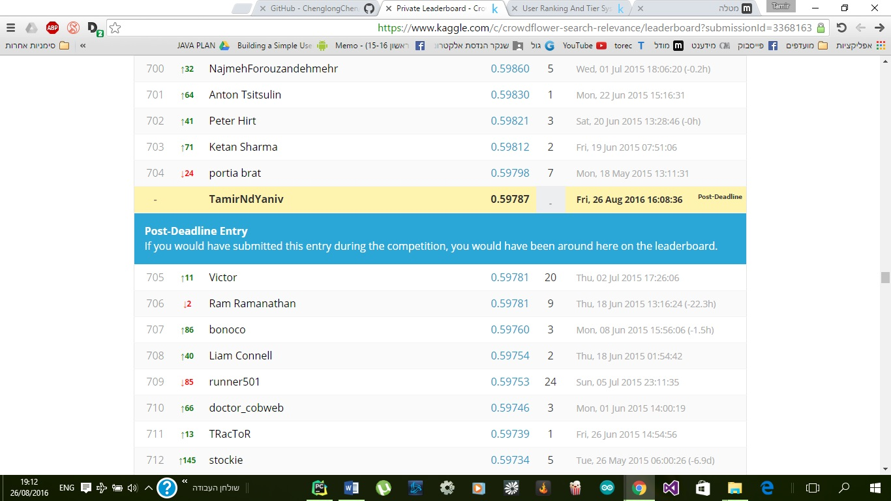

# ex4<br>
<br>
Crowdflower Search Results Relevance .<br>
<br>
The preprocessing was all about word replacement, spelling correction and synonym replacement for deep learning.<br>
we started with building a model using ensemble selection, by creating a library that is intended to be as diverse as possible to<br>
capitalize on a large number of unique learning approaches.<br>
to decode we calculated the precentage of any relevant level, by that we rank the prediction in order and gave weight for the models.<br>
```python
train = pickle.load(open('train_extracted_df.pkl', 'rb'))
test = pickle.load(open('test_extracted_df.pkl', 'rb'))
y_train = train["median_relevance"]

#Name the features to be used in the first 3 models (Random Forest, SVC, Adaboost).
features = ['query_tokens_in_title', 'query_tokens_in_description', 'percent_query_tokens_in_description', 'percent_query_tokens_in_title', 'query_length', 'description_length', 'title_length', 'two_grams_in_q_and_t', 'two_grams_in_q_and_d']

#Random forest model
print("Begin random forest model")
model = RandomForestClassifier(n_estimators=300, n_jobs=1, min_samples_split=10, random_state=1, class_weight='auto')
rf_final_predictions, rf_score = ouput_final_model(model, train, test, features)
pickle.dump(rf_final_predictions, open('rf_final_predictions.pkl', 'wb'))

#SVC
print("Begin SVC model")
scl = StandardScaler()
svm_model = SVC(C=10.0, random_state = 1, class_weight = {1:2, 2:1.5, 3:1, 4:1})
model = Pipeline([('scl', scl), ('svm', svm_model)])
svc_final_predictions, svc_score = ouput_final_model(model, train, test, features)
pickle.dump(svc_final_predictions, open('svc_final_predictions.pkl', 'wb'))

#AdaBoost
print("Begin AdaBoost model")
model = AdaBoostClassifier(n_estimators=200, random_state = 1, learning_rate = 0.25)
adaboost_final_predictions, ada_score = ouput_final_model(model, train, test, features)
pickle.dump(adaboost_final_predictions, open('adaboost_final_predictions.pkl', 'wb'))
```
<br>
we mostly relied on numpy and SVD, and for the training part, on keras.<br>
<br>
The ScreenShot:<br>

